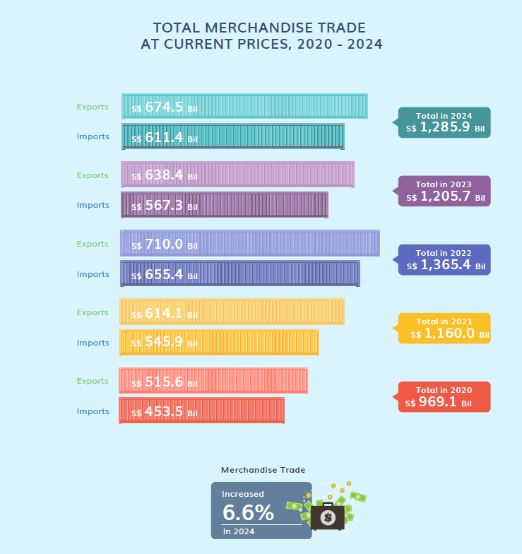

# Overview

## Background

The political turbulence in the United States of America has made global trade one of the most closely watched topics in recent years. Their actions and policies greatly affect the world's economy and individual countries want to know what impact they will have on their own economies. This assignment examines Singapore's trade data to gain insights on their economic relationships with other nations.

## Objectives

The goal of this assignment is to critically analyze visualizations from Singapore's trade report and improve them using `ggplot2` and other relevant R packages. The makeover should enhance clarity, readability, and interpretability while ensuring that key trade insights are effectively communicated.

# Getting Started

## Installing and loading packages

The following R packages will be used:

-   **tidyverse:** A collection of R packages designed for data manipulation, exploration, and visualization, providing a consistent and easy-to-use syntax.

-   **plotly**: R package for creating interactive and dynamic data visualizations.

-   **ggthemes:** Offers additional themes and color schemes for ggplot2, enabling more visually appealing and customized plots.

-   **patchwork:** Facilitates combining multiple ggplot2 plots into a single layout, making it easy to create complex multi-panel visualizations.

-   **scales:** Allows customization of axis labels, breaks, and scales in ggplot2, improving plot readability and presentation.

-   **tsibble:** Provides a framework for working with time-series data in a tidy format.

-   **lubridate:** Helps parse, manipulate, and analyze date/time information.

-   **feasts**: Works with tsibble to analyze time-series components (trend, seasonality, residuals).

```{r}
pacman::p_load(readxl, data.table, tidyverse, plotly, ggthemes, patchwork, scales, tsibble, lubridate, feasts)
```

# The Datasets

The data used are from the Department of Statistics Singapore [website](https://www.singstat.gov.sg/find-data/search-by-theme/trade-and-investment/merchandise-trade/latest-data). Specifically, we will be importing the following excel spreadsheets:

-   Merchandise Trade By Commodity Section, (At Current Prices), Monthly \[TradeCommodity.xlsx T1\]

-   Merchandise Trade By Region and Selected Market (Imports), Monthly \[TradeRegion.xlsx T1\]

-   Merchandise Trade By Region and Selected Market (Domestic Exports), Monthly \[TradeRegion.xlsx T2\]

-   Merchandise Trade By Region and Selected Market (Re-Exports), Monthly \[TradeRegion.xlsx T3\]

## Importing the Data

```{r}
df1 <- read_excel("data/TradeCommodity.xlsx", sheet = 'T1')
```

The columns for TradeCommodity.xlsx was shown to have a mix of numeric and character types. Therefore, col_types = "text" is used to standardised the column type to text.

```{r}
df1 <- read_excel("data/TradeCommodity.xlsx", sheet = 'T1', col_types = "text")
```

```{r}
df2 <- read_excel("data/TradeRegion.xlsx", sheet = 'T1')
df3 <- read_excel("data/TradeRegion.xlsx", sheet = 'T2')
df4 <- read_excel("data/TradeRegion.xlsx", sheet = 'T3')
```

## Data Preparation

First, we examine the data to confirm the structure. We will need to convert the column names (Year-Month) into rows.

```{r}
head(df1)
```

### Check for missing values

Even though colSums(is.na(df1)) shows no missing values, we can observe that there are indeed 'na' character strings in the data. However, they are only observed in the data before 1975. This would not affect the assignment as we are only concerned about the data starting from 2020-2024.

```{r}
colSums(is.na(df1))
colSums(is.na(df2))
colSums(is.na(df3))
colSums(is.na(df4))
```

### Reshape the Data Using pivot_longer()

```{r}
colnames(df1) <- as.character(colnames(df1))

commodity <- df1 %>%
  pivot_longer(cols = -`Data Series`, names_to = "Year_Month", values_to = "Trade_Value") %>%
  mutate(Trade_Value = suppressWarnings(as.numeric(Trade_Value))) 
```

### Filter out the relevant data

For the first visualisation, we are specifically concerned about the Total Merchandise Imports (At Current Prices), Total Merchandise Exports (At Current Prices) and the Total Merchandise Trade (Imports + Exports), (At Current Prices) from 2020 to 2024. Therefore, we filter those rows out.

```{r}
commodity_total <- commodity %>%
  filter(`Data Series` %in% c("Total Merchandise Imports, (At Current Prices)", "Total Merchandise Exports, (At Current Prices)", "Total Merchandise Trade, (At Current Prices)"))
```

```{r}
commodity_total <- commodity_total %>%
  mutate(Year = year(parse_date_time(Year_Month, orders = "ym"))) %>% 
  filter(Year >= 2020 & Year <= 2024) %>%
  group_by(Year, `Data Series`) %>%
  summarise(Total_Trade_Value = sum(Trade_Value, na.rm = TRUE)) %>% 
  ungroup()
```

### Final Look at the Datasets

#### Visualisation 1

```{r}
head(commodity_total)
glimpse(commodity_total)
```

# Visualisation 1 - Total Merchandise Trade at Current Prices, 2020 - 2024



::: callout-note
## Comments on Fig. 1

#### **Pros:**

-   Provides an overview of Singapore's trade growth over time.

-   Clearly distinguishes between exports and imports with separate values.

-   Uses a chronological format to highlight trends.

#### **Cons:**

-   The visualization is heavily text-based, making it hard to grasp trends at a glance.

-   No clear graphical elements such as bars or lines to show trends.

-   The numeric values can be overwhelming without visual cues.
:::

## Makeover

```{r}


ggplot(commodity_total, aes(x = Year, y = Total_Trade_Value / 1e6, color = `Data Series`, group = `Data Series`)) +  
  geom_line(size = 1) +
  geom_point(size = 2) +

  geom_text(aes(label = scales::comma(Total_Trade_Value / 1e6)), vjust = -0.5, hjust = 0.5, size = 3) +  

  theme_minimal() +
  labs(title = "Yearly Trend of Merchandise Trade (2020-2024)",
       x = "Year",
       y = "Trade Value (S$ Billion)",  
       color = "Legend") +
  scale_x_continuous(breaks = seq(2020, 2024, 1)) +
  scale_y_continuous(labels = label_number(scale = 1))
```